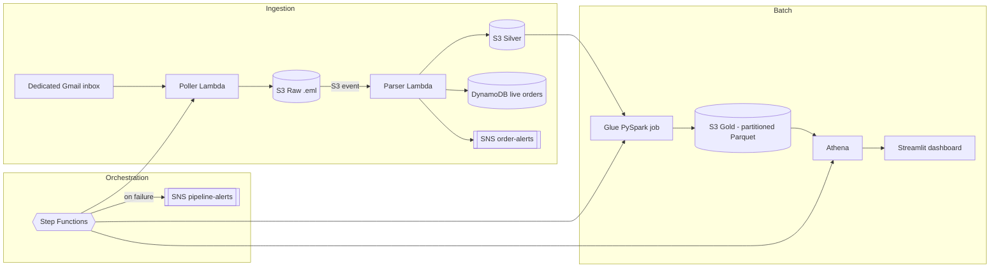

# Real-Time Email Order Pipeline

A serverless, event-driven data pipeline on AWS: order-export files arrive as
email attachments, get ingested, cleaned, and reconciled across three
formats, and land in a queryable warehouse layer with a live dashboard — all
orchestrated with visible retries and failure alerting, running at
effectively $0 on AWS free tier.

## Architecture



**Flow:** an order-export file is emailed to a dedicated inbox → a Lambda
polls it over IMAP and writes raw `.eml` files to S3 → a second Lambda
extracts the attachment, writes it to a silver layer, upserts a live view to
DynamoDB, and fires an SNS alert for high-value orders → a Glue (PySpark) job
reconciles all three formats, cleans the data, and writes partitioned Parquet
to a gold layer → Athena queries the gold layer → a Streamlit dashboard
visualizes it. Step Functions ties the poller, Glue, and Athena partition
refresh into one scheduled, monitored run.

## Repository structure

```
.
├── lambda/
│   ├── poller/lambda_function.py    # IMAP -> S3 raw, UID checkpointing
│   └── parser/lambda_function.py    # raw -> silver + DynamoDB + SNS alert
├── glue/
│   └── order_reconciliation.py      # silver -> gold: reconcile, clean, dedupe
├── step_functions/
│   └── state_machine_definition.json  # orchestrates poller -> glue -> athena
├── dashboard/
│   ├── dashboard.py                 # Streamlit app, queries gold via Athena
│   └── requirements.txt
├── sql/
│   └── create_gold_table.sql        # Athena/Glue Data Catalog table DDL
└── sample_data/
    └── test_orders.csv              # sample order file to email in for testing
```

Each piece was built and deployed manually via the AWS Console (Lambda, S3,
Glue, IAM roles, Step Functions, CloudWatch) rather than via IaC — the code
here reflects the final, debugged, working state of each component.

## Tech stack

AWS Lambda · S3 · Glue (PySpark) · DynamoDB · Athena · Step Functions ·
EventBridge Scheduler · SNS · CloudWatch · Python (boto3, pandas) · Streamlit

## Key design decisions

- **Medallion architecture (raw → silver → gold).** Raw `.eml` files are kept
  untouched for replay/audit; silver holds parsed-but-unreconciled data per
  format; gold holds the cleaned, deduped, schema-unified result partitioned
  by date.
- **Idempotent, incremental ingestion.** The poller checkpoints the last
  processed Gmail UID in SSM Parameter Store and always searches
  `UID {last+1}:*`, so re-running it never reprocesses old mail.
- **Hot path / cold path split.** The parser writes directly to DynamoDB and
  fires an SNS alert for high-value orders in near-real-time, while Glue
  handles heavier batch cleaning and cross-format reconciliation on its own
  schedule — a small lambda-architecture pattern.
- **Multi-format schema reconciliation.** Export files vary in format
  (CSV/JSON/Parquet) and date formatting; the Glue job unifies these under
  one schema and reconciles multiple date formats before partitioning.
  Files are discovered via explicit S3 listing (`boto3`) rather than Spark's
  directory reader, since Spark doesn't recurse into nested date-partitioned
  folders without extra configuration.
- **Orchestration with visible failure handling.** A Step Functions state
  machine drives Poller → Glue → Athena partition refresh with `Retry` on
  transient errors and a `Catch` on every state routing to one SNS failure
  alert — a single alert path for the whole pipeline instead of three
  separate places to go looking when something breaks.
- **Monitoring.** CloudWatch alarms on Step Functions `ExecutionsFailed` and
  on the Parser Lambda's `Errors` metric (the one component outside the
  state machine, since it's S3-event-triggered rather than scheduled).
- **Cost-aware by design.** DynamoDB and SSM run on-demand/free tiers, Glue
  is capped at 2 DPUs on an infrequent schedule, and the dashboard caches
  Athena query results since Athena bills per TB scanned.

## Setup notes

The files here use placeholders for anything account-specific:

- `<YOUR_ACCOUNT_ID>` in `step_functions/state_machine_definition.json`
- `<YOUR-ATHENA-RESULTS-BUCKET>` in `dashboard/dashboard.py` and the state
  machine definition

Fill these in locally if you deploy from this repo — they're intentionally
left out of version control rather than committed with real values.

## Running it

1. Email an order-export file (see `sample_data/test_orders.csv`) as an
   attachment to the dedicated Gmail inbox.
2. The pipeline runs on a 15-minute schedule via Step Functions, or trigger
   it manually from the Step Functions console.
3. `pip install -r dashboard/requirements.txt && streamlit run dashboard/dashboard.py`
   to view revenue-by-day and revenue-by-category.

## summary

> Built a serverless, event-driven order-processing pipeline on AWS (Lambda,
> S3, Glue/PySpark, DynamoDB, Athena) with idempotent ingestion, multi-format
> schema reconciliation, and sub-5-min data freshness — orchestrated via
> Step Functions with retry/failure handling, monitored via CloudWatch alarms.
